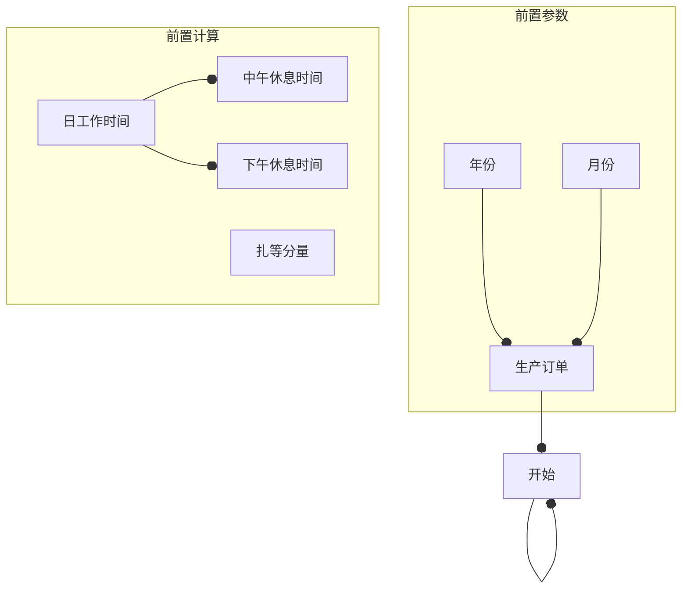

# 生管部

## 自动排程

```mermaid
graph TD
	subgraph 前置参数
	year[年份]
	month[月份]
	prodo[生产订单]
	year --o prodo
	month --o prodo
	end
	prodo --o start
	start --o 
	start[开始]
	subgraph 前置计算
	workdayTime[日工作时间]
	equalSplit[扎等分量]
	noonRest[中午休息时间]
	afternoonRest[下午休息时间]
    workdayTime --o noonRest
    workdayTime --o afternoonRest
	end
	
```

## 行事历

