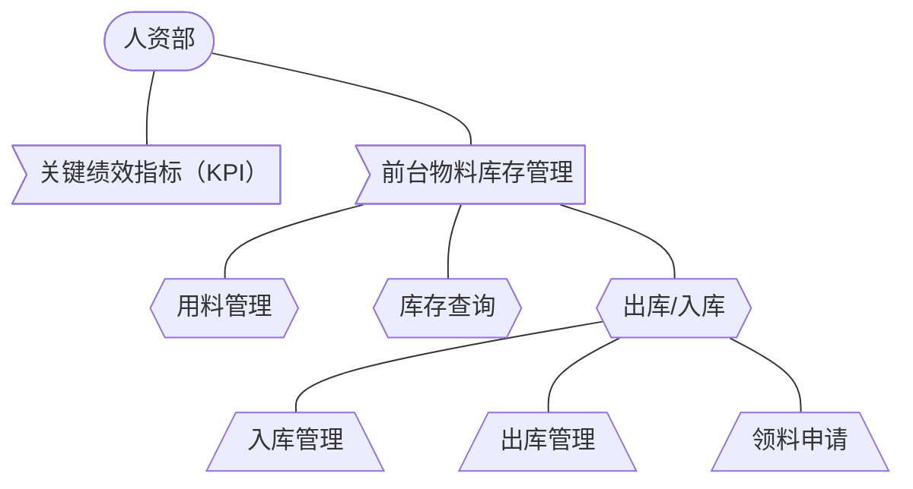

# 人资部

提供了【关键绩效指标（KPI）】、【前台物料库存管理】功能模块，访问需要相应的授权权限。

**功能结构图：**

## 关键绩效指标（KPI）

## 前台物料库存管理

日常使用材料物品管理。

### 用料管理

可建立用料列表、分类，并对其进行添加和编辑管理。

> 

> 

### 库存查询

查看用料库存和库存操作明细

> 

> 

### 出库/入库

用料的入库、出库和出库审核。

入库：

> 

> 

申请审核：

> 

> 

领料申请：

> 
