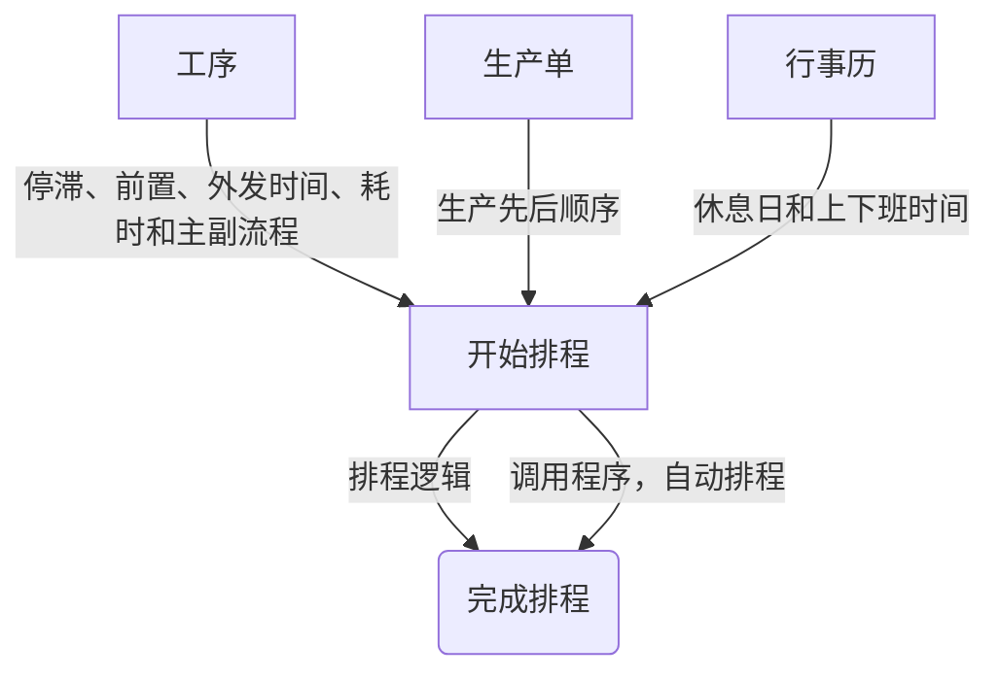

# 生产部

## 自动排程

### 排程逻辑

1.  默认排程开始时间为每月的第一天，默认的上下班时间是 <u>**7:30-11:30 13:00-17:00 17:30-20:30**</u>，可通过行事历自由设定。
2.  生产单的第一工序开始时间为上一生产单第一工序完成时间。
3.  一个生产单中的每个工序生产量会按数量等分，第一个工序的第一等分生产量完成时间，则是后面工序的开始时间，依次类推
4.  排到休息日、停滞时间、前置时间、外发时间（外包出去工序的完成时间），则累加进去。
5.  工序生产分为主、辅流程生产。辅流程工序开始时间为上一生产单第一工序的第一等分生产量完成时间。

### 程序使用
- 选择生产单
 > 
- 自动排程
 > 
- 不同排版样式
 > 
- 报表预览
 > 
## 行事历

