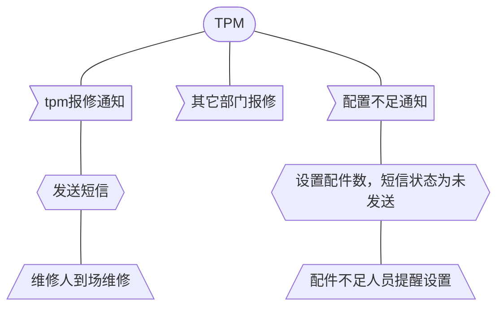

# TPM

访问需要授权

**功能结构图：**

```mermaid
graph TD
	 dept([TPM])---mod1>"tpm报修通知"]
	 dept([TPM])---mod2>其它部门报修]
   dept([TPM])---mod3>配置不足通知]
	 mod1---section1{{发送短信}}
	 mod3---section2{{"设置配件数，短信状态为未发送"}}
	 section1---fun1[/维修人到场维修\]
	 section2---fun2[/配件不足人员提醒设置\]
```

## TPM模块

### 设备列表

查看所有设备信息，添加设备以及查看所有配件设置配件信息发送

> 

> 

### 维修通知

维修通知使用图示

> 

1、报修设备选择并初步判断原因
> 

维修人员到场确认
> 

2、填写维修方法
> 

3、最后一步
> 

4、查看生成的维修数据
> 
